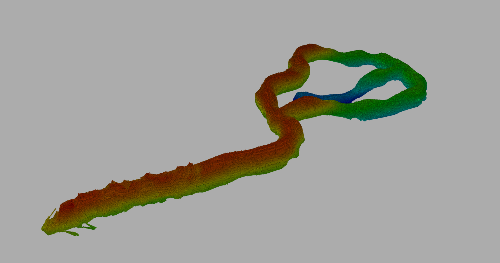

# Autonomous Drone Cave Exploration System

This repository contains a ROS 2 Jazzy-based autonomous drone exploration system designed for navigating and mapping complex cave environments using OctoMap. The system integrates high-level decision-making, frontier-based exploration, reactive trajectory generation, and computer vision-based perception.

---

## Prerequisites

### 1. Install ROS 2 Jazzy

Ensure that ROS 2 Jazzy is installed on your system.

**Reference:** [ROS 2 Jazzy Installation Guide](https://docs.ros.org/en/jazzy/Installation.html)

### 2. Install Required System Dependencies

Run the following command to install mapping, perception, TF2, and point cloud processing dependencies:

```bash
sudo apt update
sudo apt install -y \
    ros-jazzy-octomap \
    ros-jazzy-octomap-server \
    ros-jazzy-octomap-msgs \
    ros-jazzy-depth-image-proc \
    ros-jazzy-cv-bridge \
    ros-jazzy-tf2-ros \
    ros-jazzy-tf2-geometry-msgs \
    python3-numpy

```

---

## Build Instructions

The repository includes a `src` folder and acts as a complete ROS 2 workspace.

1. **Source ROS 2 Jazzy:**
```bash
source /opt/ros/jazzy/setup.bash

```


2. **Clone the Repository:**
```bash
git clone https://github.com/RoboCrafty/FinalProjectAutonomousSystem.git && cd FinalProjectAutonomousSystem

```


3. **Install Remaining Dependencies:**
```bash
rosdep install --from-paths src -y --ignore-src

```


4. **Build the Workspace:**
```bash
colcon build

```

## Simulator Setup (Unity)

Two simulator versions are available:

- **Low-Quality (LQ)** – Recommended for less powerful machines  
- **High-Quality (HQ)** – Better visuals

# Setup Steps

1. Choose either the **LQ** or **HQ** simulator.
2. Copy the simulator executable **and its corresponding data folder** into:

```
install/simulation/lib/simulation/
```

3. Rename them to the default names so the launch file can detect them:

- Executable → `Simulation.x86_64`
- Data folder → `Simulation_Data`

⚠️ Both names must match exactly.

---

## Running the Project

You need **two terminals**.

In BOTH terminals, from the root of your repository:

```bash
source install/setup.bash
```

### Terminal 1: Launch Simulation

```bash
ros2 launch simulation simulation.launch.py

```
Wait until the Unity window fully loads before continuing.

### Terminal 2: Launch Exploration Mission

```bash
ros2 launch decision_making_pkg mission.launch.py

```


---

## Package Overview

### 1. Decision Making Package (`decision_making_pkg`)

Acts as the high-level **Decision Making Layer**. It implements a **Finite State Machine (FSM)** in `state_machine.cpp` that sequences mission phases—from initial takeoff and cave entry to frontier exploration and mission completion.

**Core Functionalities:**

* **Sequential Mission Control**: Manages the high-level lifecycle transitions between approach, exploration, and completion phases.
* **Sub-Step Sequencing**: Handles complex maneuvers within a single state, such as the multi-point entry sequence.
* **One-Shot Dispatch Logic**: Uses a `target_sent_` flag to publish goal coordinates exactly once per transition.
* **Environmental Reset**: Automatically triggers an Octomap reset via service call upon reaching the cave entrance.

**Topic & Service Interfaces:**
| Interface | Type | Direction | Brief Explanation |
| :--- | :--- | :--- | :--- |
| `/current_state_est` | `nav_msgs/msg/Odometry` | **Sub** | Real-time position for distance checking |
| `/exploration_complete` | `std_msgs/msg/Bool` | **Sub** | Trigger to transition to final state |
| `/next_setpoint` | `geometry_msgs/msg/PoseStamped` | **Pub** | Dispatches navigation goals |
| `/enable_exploration` | `std_msgs/msg/Bool` | **Pub** | Master toggle for the frontier algorithm |
| `/octomap_server/reset` | `std_srvs/srv/Empty` | **Srv** | Clears occupancy map before cave entry |

---

### 2. Exploration Package (`exploration_pkg`)

The autonomous core implementing a topological graph-based frontier exploration strategy via the `frontier_explorer.cpp` node.

**Frontier Detection & Clustering:**

* **Logic:** Identifies "Free" voxels adjacent to "Unknown" space within a local 60m box.
* **Algorithm:** Nearest-Neighbor Centroid Clustering groups voxels within 1.2m to create targets.

**Advanced Strategy:**

* **Dynamic Threshold Reduction:** Reduces required voxel counts by 30 per iteration if no large clusters are found.
* **Heading Bias:** Multiplies cluster scores by a bias to prefer deeper cave penetration.
* **Forbidden Radius:** Ignores frontiers within 8.0m of existing graph nodes to prevent local oscillations.

**Topic Interfaces:**
| Topic | Type | Direction | Brief Explanation |
| :--- | :--- | :--- | :--- |
| `/current_state_est` | `nav_msgs/msg/Odometry` | **Sub** | Position for graph building |
| `/octomap_binary` | `octomap_msgs/msg/Octomap` | **Sub** | Global map for collision checks |
| `/enable_exploration` | `std_msgs/msg/Bool` | **Sub** | Activation toggle from FSM |
| `/next_setpoint` | `geometry_msgs/msg/PoseStamped` | **Pub** | Target sent to trajectory generator |
| `/exploration_complete` | `std_msgs/msg/Bool` | **Pub** | Finish signal sent to FSM |

---

### 3. Trajectory Generator Package (`trajectory_generator_pkg`)

The "Math Engine" that converts discrete waypoints into physically feasible 4D polynomial curves.

**Implementation Details:**

* **Optimization:** Uses `mav_trajectory_generation` with a Linear Solver for numerical stability.
* **Adaptive Orientation:** Handles rotation logic; preserves current yaw if goal orientation is zero.
* **100Hz Setpoint Stream:** Samples the trajectory every 10ms for high-frequency control.

**Topic Interfaces:**
| Topic | Type | Direction | Brief Explanation |
| :--- | :--- | :--- | :--- |
| `/current_state_est` | `nav_msgs/msg/Odometry` | **Sub** | Tracks current drone state for anchoring |
| `/next_setpoint` | `geometry_msgs/msg/PoseStamped` | **Sub** | High-level goal input |
| `/command/trajectory` | `trajectory_msgs/msg/MultiDOFJointTrajectory` | **Pub** | High-frequency setpoint stream |

---

### 4. Perception Package (`perception_pkg`)

Transforms raw sensor data into environmental representations.

**Core Features:**

* **Octomap Generation:** Converts depth images to occupancy maps at 0.6m resolution.
* **Efficiency:** Configured to ignore data beyond 40m to reduce computational load.

**Topic Interfaces:**
| Topic | Type | Direction | Brief Explanation |
| :--- | :--- | :--- | :--- |
| `/realsense/depth/image` | `sensor_msgs/msg/Image` | **Sub** | Raw depth data input |
| `/octomap_binary` | `octomap_msgs/msg/Octomap` | **Pub** | 3D map output for navigation |

---

### 5. Lantern Detection Package (`lantern_detection_pkg`)

Specialized vision for identifying mission-specific objects.

**Topic Interfaces:**
| Topic | Type | Direction | Brief Explanation |
| :--- | :--- | :--- | :--- |
| `/Quadrotor/Sensors/SemanticCamera/image_raw` | `sensor_msgs/msg/Image` | **Sub** | Semantic image for color masking |

---

### 6. Teleop Package (`teleop_pkg`)

Manual flight interface with smoothed velocity setpoints.

**Topic Interfaces:**
| Topic | Type | Direction | Brief Explanation |
| :--- | :--- | :--- | :--- |
| `/true_pose` | `geometry_msgs/msg/PoseStamped` | **Sub** | One-time initialization of target state |
| `/command/trajectory` | `trajectory_msgs/msg/MultiDOFJointTrajectory` | **Pub** | 50Hz trajectory setpoints |


---


## Summary

1. Install ROS 2 Jazzy  
2. Install dependencies  
3. Clone repo  
4. `rosdep install`  
5. `colcon build`  
6. Copy & rename Unity simulator  
7. Launch simulation (Terminal 1)  
8. Launch mission (Terminal 2)

---

Your autonomous drone should now begin exploring and building an OctoMap of the cave environment.


## Generated OctoMap

Below is an example of the generated 3D occupancy map produced during autonomous cave exploration:



> The drone autonomously explored the cave environment and incrementally built this OctoMap representation in real time.

---

***This project was developed for the Autonomous Systems Winter Semester 2025 Group Project.***